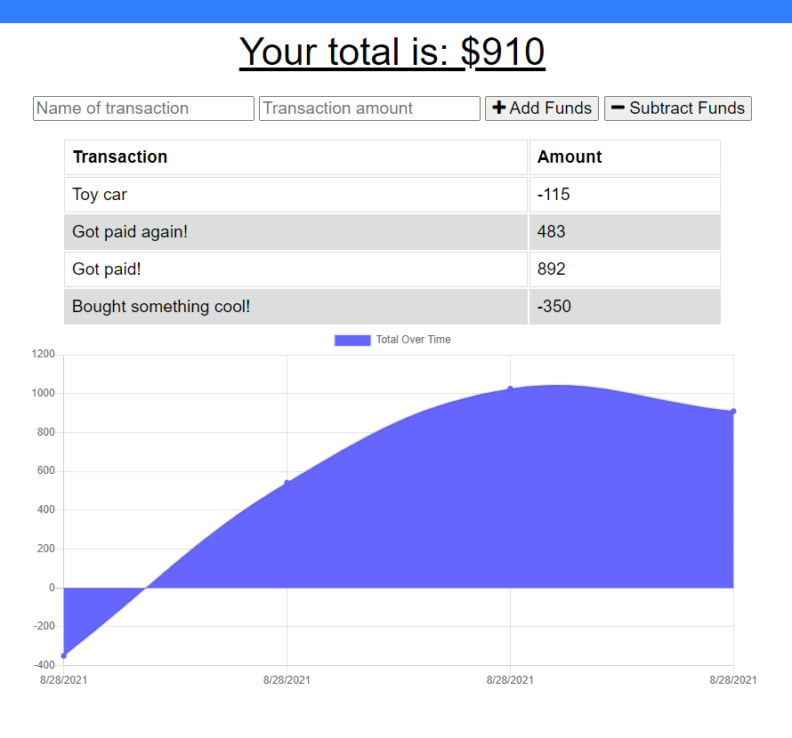

# BUDGET TRACKER 
## Description
A responsive web application for keeping up with your finances, depicting your entries and a chart to represent them visually.

[Link to the live application](https://powerful-stream-24219.herokuapp.com/)

## Table of Contents

- [Usage](#Usage)
- [Questions](#Questions)
- [Code-of-Conduct](#Code-of-Conduct)
- [License](#License)

## Usage
This application takes advantage of the IndexedDB Web and Service Worker Web APIs, enabling slow- and no-internet functionality. Furthermore, it is a Progressive Web Application; it can be installed to your phone, tablet or computer!

## Questions
If you need to reach me, my GitHub username (and a link to my profile page) is [RookiePrime](https://github.com/RookiePrime) and my email address is [kiefer_8@hotmail.com](mailto:kiefer_8@hotmail.com).

## Code-of-Conduct
### Contributor Covenant
We as members, contributors, and leaders pledge to make participation in our
community a harassment-free experience for everyone, regardless of age, body
size, visible or invisible disability, ethnicity, sex characteristics, gender
identity and expression, level of experience, education, socio-economic status,
nationality, personal appearance, race, caste, color, religion, or sexual identity
and orientation.

We pledge to act and interact in ways that contribute to an open, welcoming,
diverse, inclusive, and healthy community.
[Click here to read the full code of conduct](https://www.contributor-covenant.org/version/2/0/code_of_conduct/)

## License
This software is offered under the MIT License. For more information on conditions of use, [follow this link.](https://opensource.org/licenses/MIT).
